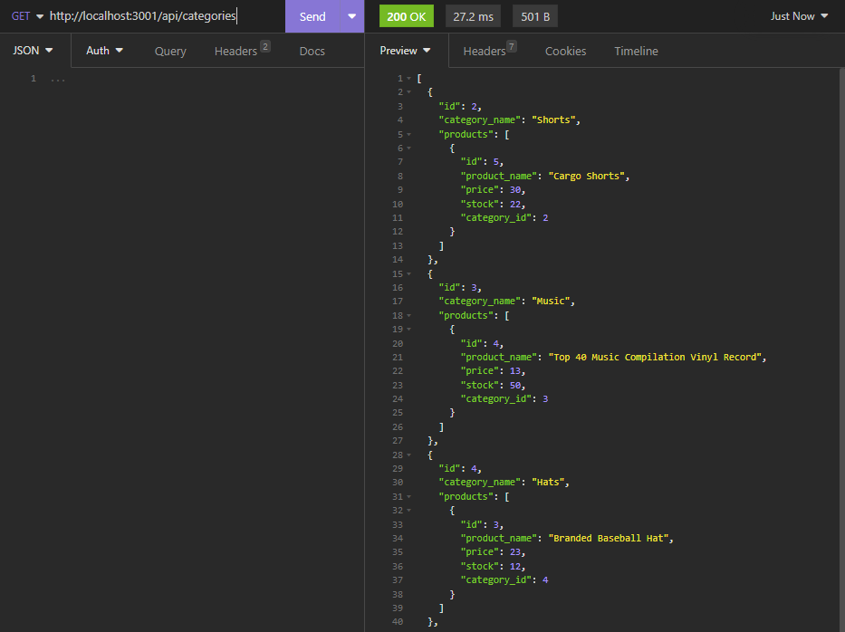
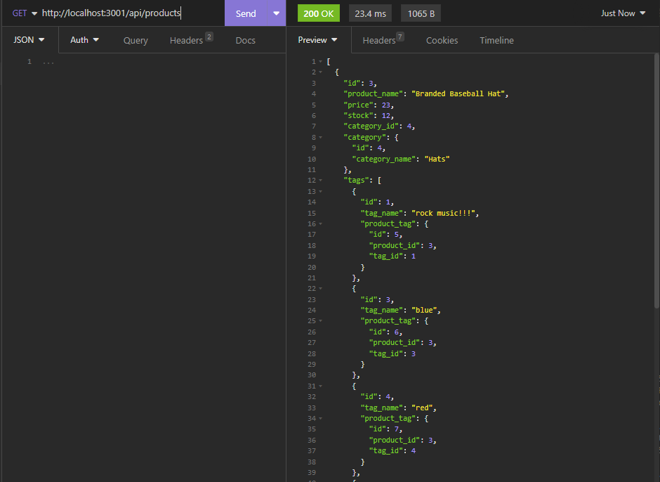

# README.MD Ecommerce Backend

## Author

Devin Nunez

Email: devv-nunn@gmail.com
git: https://github.com/devv-nunn

## Description

In this project we will be assisting with crating a backend application for a ecommerce website.

We will be using the sequalize ORM to populate and make changes to our database using routes and CRUD operations.

In this project we learned more about the sequalize ORM and how we can use it to make database changes. 
## Table of Contents (Optional)

N/a

## Installation

- vs.code and node.js must be installed to use this applicationn

- Clone the following repository after installing vs.code and node.js 

- in terminal run npm i as it will download necessary dependencies such as express, sequalize, and mysql12

- for mysql download docker and start a mysql container. Documentation on this process online.

## Usage

To use this application start a docker container that will host your sql instance.
open docker and run mysql in vs.code terminal. (Docker documentation online).
After connecting to your docker database go to another terminal and run npm i to install all necessary dependencies.

After running npm i start application using nodemon "npm run watch". This will allow server to restart after every change instead of closing and reopening the server for productivity purposes. 

After running the application using nodemon you can then go to insomnia and test your routes. 

We are able to perform all CRUD operations to each of the routes.

## Application screenshots

## Videos Demonstrating application:

application functionality showcase:
https://drive.google.com/file/d/1Jf76aNdXSAlJR0ENvv40R2dS7FPKQBXe/view

## Deployment

Repo: https://github.com/DevinDevelopment/EcommerceBackend

# Tech Stack

JavaScript
node.js
Sequalize
mysql

## Credits

N/a

## License

MIT License.